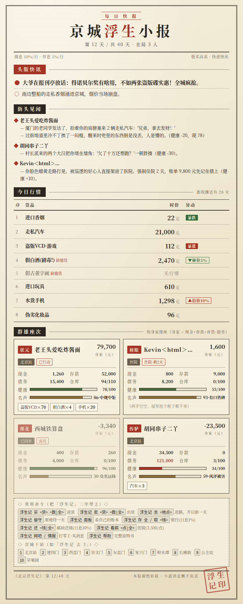
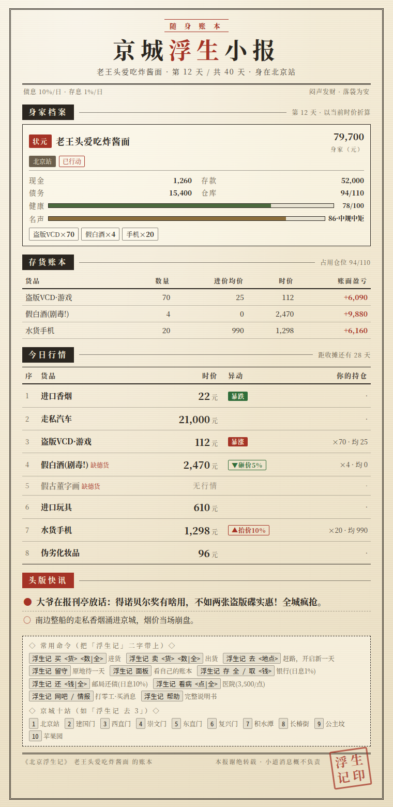
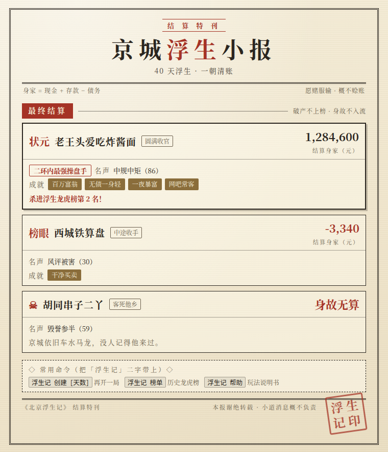
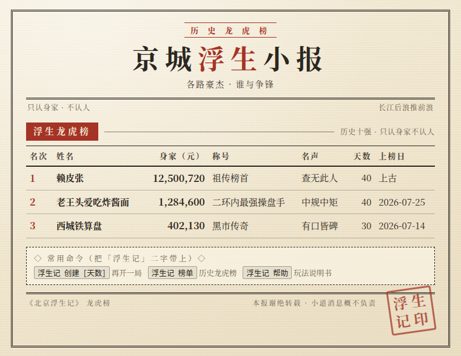
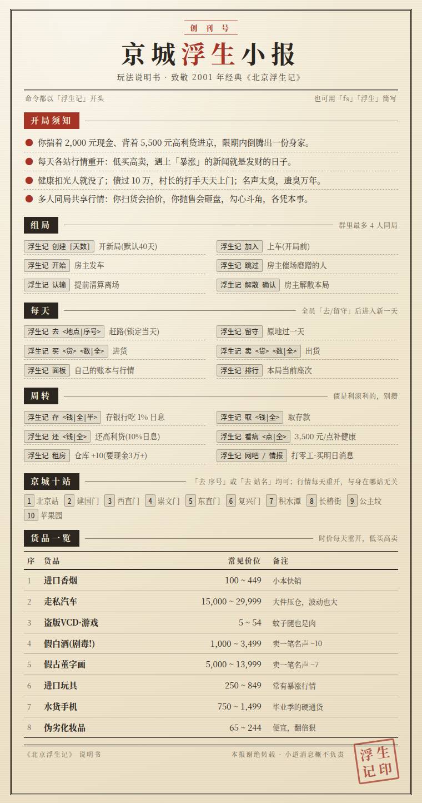

# astrbot_plugin_beijing_fushengji

> 群聊多人版《北京浮生记》—— 致敬 2001 年郭欣先生的经典单机游戏。
> 揣着 2,000 元现金、背着 5,500 元高利贷进京，在限期内倒买倒卖，攒出一份身家。

[](https://astrbot.app)
[](#)
[](LICENSE)

- **每回合一张报纸**：日报、账本、结算、龙虎榜全部渲染成《京城浮生小报》风格的图片（渲染服务不可用时自动降级为同内容文字）。
- **纯命令游玩**：所有操作都是一条聊天命令，每一步回复都带下一步的命令提示，不用记说明书。
- **最多 4 人同局**：共享同一张行情表，暴涨暴跌人人有份；你扫货会抬价、砸盘会压价，勾心斗角各凭本事。
- **规则忠实原版**：价格区间、事件概率、利息、打手、黑客、住院、黑中介……逐条对照原版 C++ 源码复刻（整数运算、判定顺序也一致）；文案全部原创重写。

## 截图

| 每日快报 | 随身账本 |
| :-: | :-: |
|  |  |

| 结算特刊 | 历史龙虎榜 | 玩法说明书 |
| :-: | :-: | :-: |
|  |  |  |

## 安装

- 插件市场搜索 `astrbot_plugin_beijing_fushengji` 安装；或
- 手动安装：

```bash
cd <AstrBot数据目录>/plugins
git clone https://github.com/AlanBacker/astrbot_plugin_beijing_fushengji
# 重启 AstrBot 或在管理面板重载插件
```

无第三方依赖（纯标准库）；出图走 AstrBot 内置的文转图服务，无需本地浏览器。

## 怎么玩

```
浮生记 创建        # 开一局（默认 40 天，可「浮生记 创建 20」）
浮生记 加入        # 其他人上车（最多 4 人，单人也能玩）
浮生记 开始        # 房主发车，收到第 1 天的《京城浮生小报》
浮生记 买 手机 全   # 低买……
浮生记 卖 手机 全   # ……高卖
浮生记 去 西直门    # 赶路锁定当天；全员行动完毕自动进入新的一天
```

每天流程：看报 → 买卖/周转（不限次数）→ 「去 <地点>」或「留守」锁定行动 → 全员锁定后自动翻篇，下一期日报出炉。命令前缀 `浮生记` 也可以用 `fs` 或 `浮生` 简写。

京城十站：`1北京站 2建国门 3西直门 4崇文门 5东直门 6复兴门 7积水潭 8长椿街 9公主坟 10苹果园`——「浮生记 去 3」或「浮生记 去 西直门」都行（行情每天重开，与身在哪站无关）。每期日报和说明书图片上也都印着这张站表。

### 命令总表

| 命令 | 说明 |
| --- | --- |
| `浮生记 创建 [天数]` | 开新局（5~99 天，默认 40） |
| `浮生记 加入` | 开局前上车 |
| `浮生记 开始` | 房主发车 |
| `浮生记 去 <地点\|序号>` | 赶路，锁定当天行动 |
| `浮生记 留守` | 原地过一天 |
| `浮生记 买/卖 <货> <数\|全>` | 交易（货品可用序号、简称、别名） |
| `浮生记 存/取 <钱\|全\|半>` | 银行，存款日息 1% |
| `浮生记 还 <钱\|全>` | 邮局还高利贷（债务日息 10%，过 10 万有打手上门） |
| `浮生记 看病 <点\|全>` | 医院 3,500 元/点补健康 |
| `浮生记 租房` | 黑中介换大房，仓库 +10（现金 3 万起谈） |
| `浮生记 网吧` | 打零工挣现钱（每局限 3 次） |
| `浮生记 情报` | 买明日行情的小道消息（默认 500 元，75% 准） |
| `浮生记 面板` | 自己的随身账本（持仓盈亏、行情、消息） |
| `浮生记 排行` | 本局当前座次 |
| `浮生记 榜单` | 历史龙虎榜（跨局前十，祖传榜首 12,500,720 元等你来踢） |
| `浮生记 跳过` | 房主/管理员催场：把没行动的人按「留守」处理（自己得先行动） |
| `浮生记 认输 确认` | 按时价清算，提前离场 |
| `浮生记 解散 确认` | 房主丢弃本局（不结算不上榜） |
| `浮生记 帮助` | 图片版玩法说明书 |

## 多人机制与玩法创新

原版是单机游戏，这个移植为群聊多人做了几件事：

1. **共享行情**：同局玩家看同一张价格表、同一批暴涨暴跌新闻——有人靠消息埋伏，就有人接盘。
2. **市场冲击**（可关）：同一商品当天净买入/卖出每满 25,000 元，时价 ±5%（上限 ±30%）。大户扫货全群跟着买贵，砸盘全群跟着卖贱，日报上会挂出「▲抬价 / ▼砸价」徽章。
3. **小道消息**：网吧花钱买明日预言，真消息（默认 75%）会让预言的行情次日强制兑现——群里只有你知道明天什么暴涨。
4. **回合同步**：全员「去/留守」后自动翻天；房主可「跳过」催场；超过闲置时限（默认 24 小时）后任何一条游戏命令都会先把挂机的人按「留守」处理，永不卡局。全员住院时自动快进（原版"住院扣天数"的多人等价物）。
5. **成就与龙虎榜**：10 项成就（百万富翁、无债一身轻、一夜暴富、床板下的九条命……），跨局保存的历史前十榜单。
6. **AI 说书人**（可选，默认关）：结算后由 LLM 生成一句京味收场白。可在配置里指定供应商，失败自动累计重试 3 次，再失败回退到会话默认模型，仍失败会在群里明确提示「AI 总结失败」，绝不静默吞掉。

## 与原版的差异

- 原版的违禁书刊类商品替换为「假古董字画」，价位区间与卖出的名声代价保持一致，其余 7 种货品原样保留。
- 原版每天弹窗式的随机事件文案全部原创重写（判定概率、数值与顺序不变）。
- 强制住院从"直接扣天数"改为"住院期间跳过行动"，对多人局公平；账单照记在债上。
- 排行称号、结局评语等文字为原创，向原版致意。

## 配置项

管理面板 → 插件管理 → 本插件 → 配置：

| 键 | 默认 | 说明 |
| --- | --- | --- |
| `default_days` | 40 | 创建时未指定天数的默认值 |
| `max_players` | 4 | 每局人数上限（1~4） |
| `idle_hours` | 24 | 闲置自动跳天时限（小时），0 关闭 |
| `force_text_mode` | false | 强制纯文本（不出图） |
| `market_impact` | true | 买卖冲击行情（多人博弈核心，可关掉回归原版手感） |
| `enable_hacker` | true | 黑客改存款彩蛋 |
| `intel_price` / `intel_accuracy` | 500 / 75 | 小道消息价格与准确率 |
| `ai_comment` | false | 结算后 AI 说书人点评 |
| `ai_provider_id` | 空 | 说书人指定供应商 ID（留空 = 跟随会话默认；失败 3 次自动回退） |

存档在 `data/plugin_data/astrbot_plugin_beijing_fushengji/`：每个会话一个房间档（原子写入，坏档自动隔离），榜单全局一份。删除插件不会带走存档。

## 开发

```
core/    纯游戏逻辑：引擎、行情、输入解析、存档（不依赖 AstrBot，可独立测试）
render/  版面：HTML 模板 + 上下文构建 + 纯文本兜底（图文同源）
main.py  平台适配：命令路由、会话锁、闲置跳天、渲染分发
tests/   133 项测试：规则逐条验证、序列化回环、多种子随机模糊、插件层集成
```

```bash
python -m pytest tests/ -q   # 插件层集成测试需要安装 astrbot，未装则自动跳过
```

## 致谢

- 原作：郭欣《北京浮生记》（2001）。本插件为致敬之作，机制复刻自公开源码，文案与美术为原创。
- 源码参考：[chrisguo/beijing_fushengji](https://github.com/chrisguo/beijing_fushengji)。
- 框架：[AstrBot](https://astrbot.app)。

## License

[MIT](LICENSE) © AlanBacker
